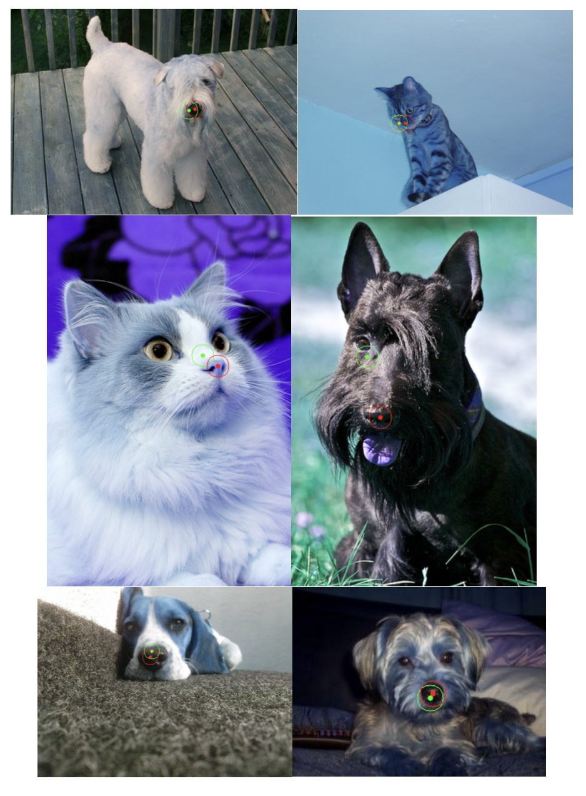
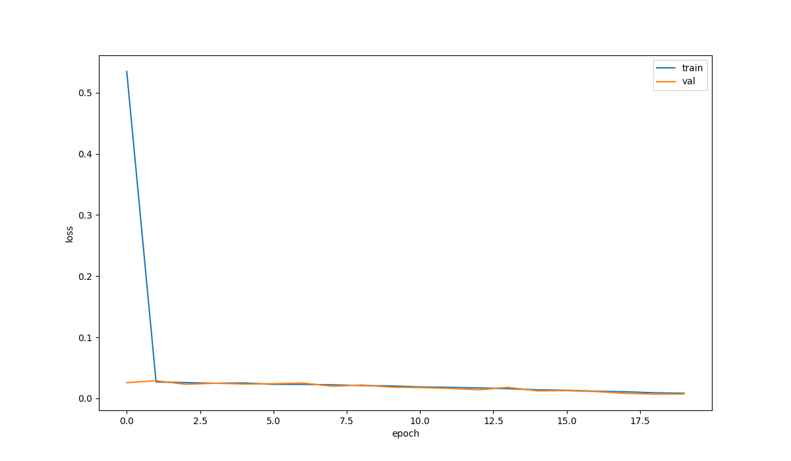

# Pet Nose Regressor

Final project for ELEC 475 - Computer Vision with Deep Learning.

## Dataset

The dataset is a modified version of the
[Oxford-IIIT Pet Dataset](https://www.robots.ox.ac.uk/~vgg/data/pets/),
with the location of all the noses labelled in a separate file.

## Results

## Loss Plot

